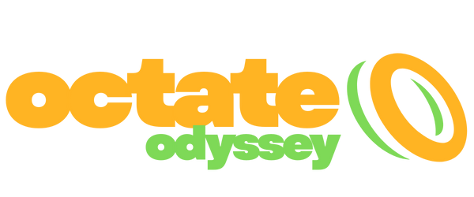

# 🌌 Octate Odyssey: The Digital Frontier

<p align="center">
  
</p>

<p align="center">
  
  
  
  
</p>

---

## 🛰️ Mission Briefing

**Octate Odyssey** is an elite learning platform designed to transform "Packet-Novices" into "Subnet-Samurais." Unlike boring textbooks, Octate Odyssey provides a gamified, high-tech command center environment where users master the fundamental architecture of the Internet.

> **"Master the matrix, one packet at a time."**

---

## ✨ Key Features

### 🖥️ High-Tech Command Terminal

Experience a realistic interactive shell that simulates network discovery, packet sniffing, and system synchronization in real-time.

### 🧱 Holographic OSI Stack

A vertical, interactive visualization of the 7-layer OSI Model. Click through layers to decrypt their functions, protocols, and data units.

### ⚡ Subnet Speedrun (Upcoming)

Calculate Network IDs, Broadcast Addresses, and CIDR masks against a ticking clock in our high-pressure simulation mode.

### 📊 Live Pilot Leaderboards

Track your progress and compete with network engineers worldwide. Earn XP and climb from **Novice** to **Network Architect**.

### 🛡️ Secure Auth Portal

A holographic login/signup interface with support for **GitHub, LinkedIn, and Google** authentication.

---

## 🎨 Brand Identity

We use a high-contrast, futuristic color palette to maintain a "Command Center" aesthetic:

- **Octate Yellow:** `#ffb423` (Energy, Access, Data)
- **Odyssey Green:** `#7ed957` (Success, Growth, Sync)
- **Deep Space Blue:** `#020617` (The Void, Security, Depth)

---

## 🛠️ Tech Stack

- **Frontend:** [Next.js 15](https://nextjs.org/) (App Router & Turbopack)
- **Styling:** [Tailwind CSS 4](https://tailwindcss.com/)
- **Animations:** [Framer Motion](https://www.framer.com/motion/)
- **Icons:** [Lucide React](https://lucide.dev/)
- **Fonts:** [Outfit](https://fonts.google.com/specimen/Outfit) & [JetBrains Mono](https://www.jetbrains.com/lp/mono/)

---

## 🚀 Deployment & Local Setup

### 1. Clone the Mission

```bash
git clone https://github.com/mustaquim-ms/octate-odyssey.git
cd octate-odyssey
```
